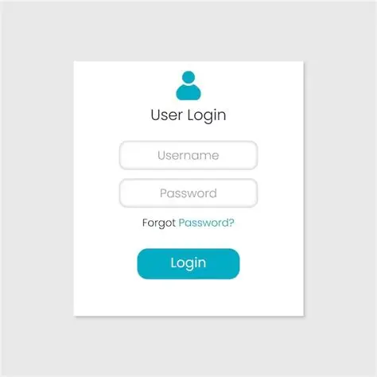
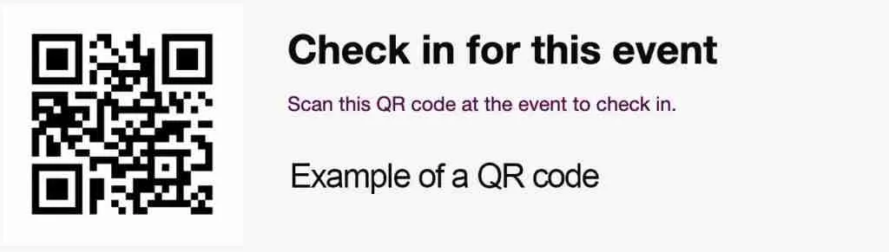

# MobileTicketsIonic

Aplicativo desenvolvido em 'Ionic / Angular', com junção ao 'Capacitor', usando tabs como templete.  
O objetivo do projeto é gerenciar tickets móveis, permitindo que usuários comprem, visualizem e validem ingressos diretamente pelo celular.

---

Funcionalidades
- Login e cadastro de usuários
- Listagem de eventos disponíveis
- Compra e armazenamento de tickets digitais
- Validação de tickets via QR Code
- Integração com recursos nativos (notificações, câmera, etc.)

---

* Telas do Projeto

### Tela de Login

### Tela de Eventos

### Tela de Ticket

